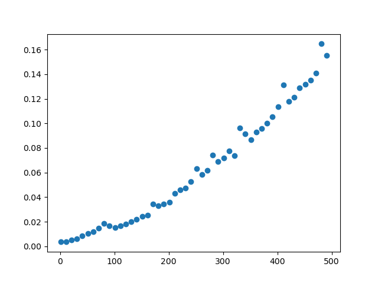

# Documentación Module 2
A continuación vamos a explicar el funcionamiento de las distintas funciones del fichero *module2.py* .

Cabe destacar que, en este módulo, usamos las siguientes bibliotecas: 
- *Csv* para la carga de datos desde archivos *csv*.
- *Urllib* para descargar los archivos FASTA desde la web.
- *Glob* para listar el directorio de archivos FASTA.
- *Bio* para localizar el RNA de la muestra dentro de un archivo FASTA.
- *Needleman_wunsch* para importar el codigo del algoritmo que calcula los aligment en lenguaje *Rust*.

##Función fasta_rna()
Esta función recibe como parámetro un diccionario que contiene los países a rellenar con su muestra FASTA
y devuelve un diccionario que contiene los paises con sus muestras FASTA asociadas.

##Función download_fasta()
Esta función recibe como parámetro un string identificador *Accession* y descarga una muestra fasta asociada al identificador
desde la web del NCBI. Devuelve la ruta dónde se ha almacenado el archivo FASTA que contiene la muestra.

##Función create_dictionary()
Esta función crea un diccionario con los datos de *alignments* a partir de un diccionario que contiene los FASTA usando 
la biblioteca de *Needlman-Wunsch* programada por nosotros en Rust.

La complejidad computacional de esta función será (siendo n y m el nñumero de países con muestra):

|Caso medio         |
|-------------------|
|O(n·m)			    | 

Los costes experimentales de ejecución de la función son de esta forma:

Como podemos ver se trata de una función cuadrática, cosa lógica debido a que el coste teórico de esta función en el caso 
medio es O(n·m) o O(n2) si n y m són iguales.

##Función load_alignments()
Esta función recibe como parámetro una lista de países presentes en el diccionario *result* y crea un diccionario con
los datos de alignments desde un *csv*.

##Función distances()
Esta función recibe como parámetro un diccionario sobre el que se quieren calcular las distancias y devuelve un 
diccionario con las distancias calculadas.