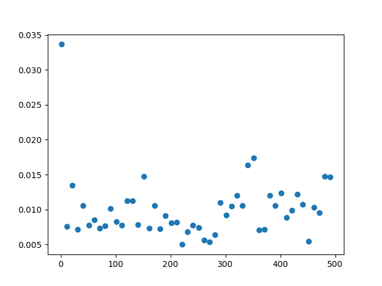

# Documentación Module 3
A continuación vamos a explicar el funcionamiento de las distintas funciones del fichero *module3.py* .

Cabe destacar que, en este módulo, importamos la librería *random* para calcular los primeros centros de manera aleatoria.

## Función clustering()
Esta función recibe como parámetros un diccionario sobre el que se quieren calcular los *clusters*, el número de *clusters*
a calcular y una tupla que contiene los primeros centros sobre los que se ejecuta el clustering (esta última variable se
utiliza para los tests). Con estos datos, aplicando el algortimo de *k-medoids*, calcula el *clustering* de los países
pasados como parámetros. 

La complejidad computacional de esta función será (siendo n el número de elementos a hacer el *clustering* y k el número 
de *clusters*):

|Caso medio         |
|-------------------|
|O(k·(n - k2))| 

Los costes experimentales de ejecución de la función son de esta forma:

Como podemos ver se trata de una función indefinidia, cosa lógica debido a que el coste teórico de esta función en el caso 
medio es O(k·(n - k2)).

## Función new_centers()
Esta función recibe como parámetros un diccionario que contiene listas de sumas asociadas a cada país y un diccionario 
que contiene los *clusters* de la vuelta actual. Con estos datos calcula los nuevos centros de cada vuelta del *clustering* 
y devuelve una lista que los contiene.
  
## Función get_center()
Esta función recibe como parámetros el país sobre el que se calcularà el centro, una lista que contiene los centros del 
*clustering* y un diccionario que contiene las distancias entre países. Con estos datos calcula el pais de la lista 
*centers* con menos distancia al pais *country*.
