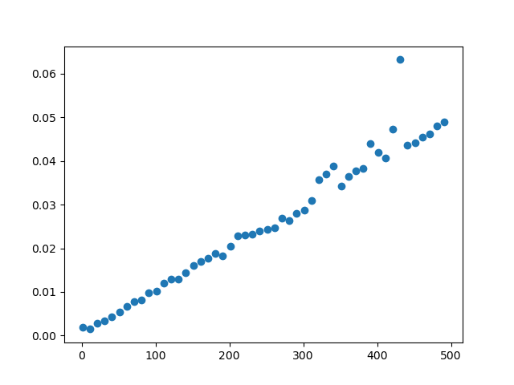

# Documentación Module 1
A continuación vamos a explicar el funcionamiento de las distintas funciones del fichero *module1.py*.

Cabe destacar que, en este módulo, importamos la librería csv para facilitar la lectura de archivos csv.

## Función select_accessions()
Es la encargada de tratar los datos del archivo .csv (contiene la información de todas las muestras).
Esta función organiza las muestras dentro de un diccionario usando el país como clave. Cada país (clave) 
lleva asociado una lista con los identificadores de las muestras (*Accession*) y otra lista con las longitudes 
de estas (*Length*).

A continuación, esta misma función llama a la función **median()** que es la encargada de rellenar un nuevo diccionario 
con la longitud mediana de cada país.

Devuelve un diccionario que contiene los países con sus muestras *Accession* usando la funcion **final_median_dict()**

## Función median()
Esta función recibe como parámetro una lista de valores y su valor medio, y devuelve el valor mediano de esta. 
En esta función se aplica la técnica *divide y vencerás* por medio de un algoritmo *quickselect* .

La complejidad computacional de esta función será:

|Peor de los casos  |Caso medio         |Mejor de los casos |
|-------------------|-------------------|-------------------|
|O(n2)   |   O(n)     |O(n)        |

Los costes experimentales de ejecución de la función son de esta forma:

Como podemos ver se trata de una función lineal, cosa lógica debido a que el coste teórico de esta función en el caso 
medio es O(n). 
## Función final_median_dict()
Esta función recibe un diccionario que contiene todos los países con su valor mediano asociado y recibe también el 
diccionario original (cada país contiene dos listas: una con las *Accessions*, y otra con las *Lengths*). 
A continuación crea un nuevo diccionario que contiene la *Accession* correspondiente a la mediana de cada país.